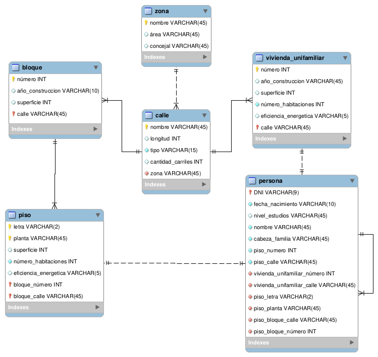
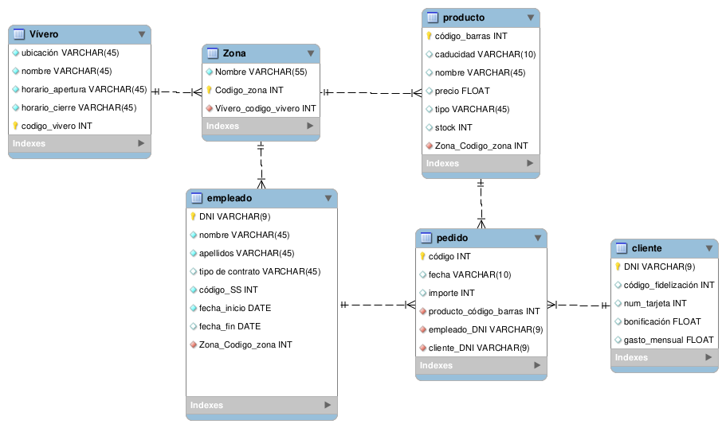
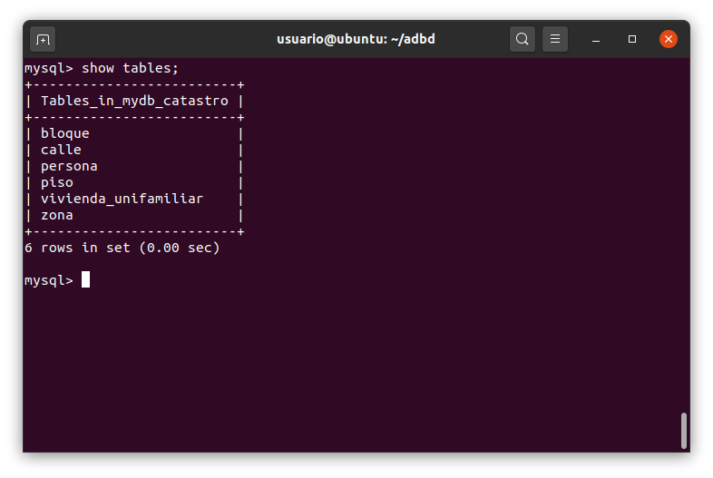
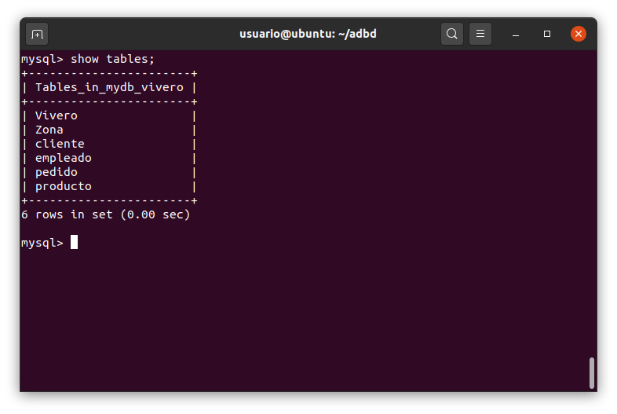

# Práctica: Modelo Lógico Relacional

- Bárbara Valentina García Deus, 
- alu0101108452

## Modelos
### Modelo del catastro:

### Modelo del vivero:

***

## Base de Datos

### Tablas de la base de datos del catastro:

- Para poder cargar la base de datos del catastro, se ha tenido que borrar que la clave ajena de `cabeza_familia` sea el DNI de la misma tabla (persona).

### Tablas de la base de datos del vívero:

